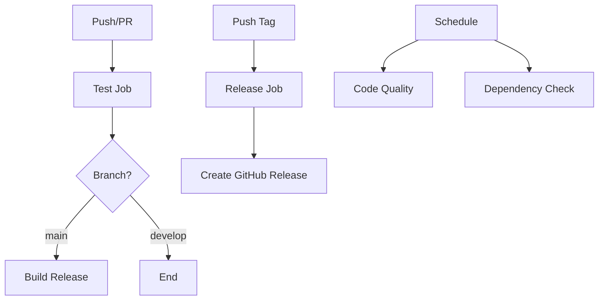

# CI/CD với GitHub Actions cho E-Directory

Dự án này được cấu hình với một hệ thống CI/CD hoàn chỉnh sử dụng GitHub Actions để tự động hóa quá trình kiểm tra chất lượng code, test, build và release.

## 📋 Tổng quan về các Workflow

### 1. **Android CI** (`.github/workflows/ci.yml`)

- **Kích hoạt**: Push/PR đến branch `main` hoặc `develop`
- **Chức năng**:
  - Chạy lint checks
  - Thực hiện unit tests
  - Build debug APK
  - Build release APK (chỉ cho main branch)
  - Upload artifacts (APK, test reports, lint results)

### 2. **Release** (`.github/workflows/release.yml`)

- **Kích hoạt**: Push tag với pattern `v*` (ví dụ: `v1.0.0`)
- **Chức năng**:
  - Build release APK
  - Tạo GitHub Release tự động
  - Upload APK file vào release

### 3. **Code Quality** (`.github/workflows/code-quality.yml`)

- **Kích hoạt**: Push/PR + schedule hàng tuần
- **Chức năng**:
  - Kiểm tra lint chi tiết
  - Chạy detekt (nếu có cấu hình)
  - Kiểm tra bảo mật cơ bản
  - Comment kết quả lint trên PR

### 4. **Dependency Check** (`.github/workflows/dependency-check.yml`)

- **Kích hoạt**: Hàng ngày + thay đổi build files
- **Chức năng**:
  - Kiểm tra cập nhật dependencies
  - Tạo báo cáo dependencies
  - Phát hiện lỗ hổng bảo mật

## 🚀 Cách sử dụng

### Để kích hoạt CI build:

```bash
git push origin main
# hoặc
git push origin develop
```

### Để tạo release:

```bash
# Tạo tag
git tag -a v1.0.0 -m "Release version 1.0.0"
git push origin v1.0.0
```

### Để trigger dependency check thủ công:

- Vào tab Actions trên GitHub
- Chọn "Dependency Check" workflow
- Click "Run workflow"

## 🔧 Cấu hình

### Yêu cầu:

- **JDK**: 17 (Temurin distribution)
- **Android SDK**: Target 35, Min 28
- **Gradle**: Wrapper được cung cấp

### Environment Variables (không cần thiết lập):

- `GITHUB_TOKEN`: Tự động cung cấp bởi GitHub Actions

### Artifacts được tạo:

- **Debug APK**: `app-debug.apk`
- **Release APK**: `app-release-unsigned.apk`
- **Lint Reports**: HTML và XML reports
- **Test Reports**: JUnit test results
- **Dependency Reports**: Dependency analysis

## 📊 Monitoring và Báo cáo

### 1. **CI Status**

- Badge status hiển thị trên README
- Notifications qua email/Slack (nếu cấu hình)

### 2. **Quality Metrics**

- Lint results tự động comment trên PR
- Test coverage reports
- Security check results

### 3. **Dependency Monitoring**

- Daily dependency checks
- Alert cho critical updates
- Security vulnerability scanning

## 🛡️ Security Features

### Kiểm tra bảo mật tự động:

- ✅ Android manifest security checks
- ✅ Exported components validation
- ✅ Debug flags detection
- ✅ Network security config recommendations

### Best Practices được áp dụng:

- Cache Gradle dependencies để tăng tốc build
- Sử dụng latest action versions
- Parallel job execution khi có thể
- Artifact retention policies

## 📝 Workflow Files Chi tiết

### Structure:

```
.github/
├── workflows/
│   ├── ci.yml                 # Main CI pipeline
│   ├── release.yml            # Automated releases
│   ├── code-quality.yml       # Code quality checks
│   └── dependency-check.yml   # Dependency monitoring
└── CICD_README.md            # Tài liệu này
```

### Key Features:

- **Fast builds**: Gradle caching
- **Quality gates**: Lint + tests must pass
- **Automated releases**: Tag-based releases
- **Security monitoring**: Regular dependency checks
- **Parallel execution**: Multiple jobs run simultaneously

## 🔄 Workflow Dependencies



## 📚 Tài liệu tham khảo

- [GitHub Actions Documentation](https://docs.github.com/en/actions)
- [Android CI/CD Best Practices](https://developer.android.com/studio/projects/continuous-integration)
- [Gradle Build Optimization](https://docs.gradle.org/current/userguide/performance.html)

## 🤝 Contributing

Khi đóng góp vào dự án:

1. **Luôn tạo PR** thay vì push trực tiếp lên main
2. **Đảm bảo CI pass** trước khi merge
3. **Review lint results** và fix các issues
4. **Update version** trong `build.gradle.kts` cho releases

---

✨ **CI/CD setup hoàn tất!** Hệ thống sẽ tự động build, test và deploy ứng dụng của bạn.
