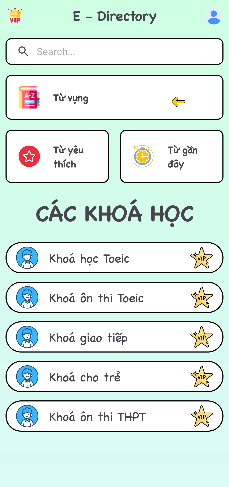
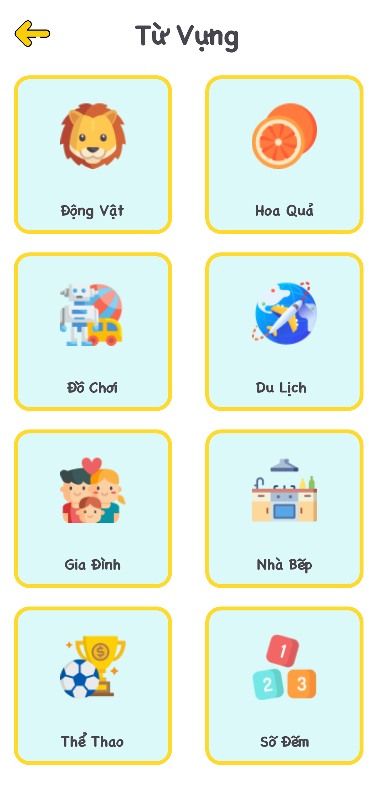
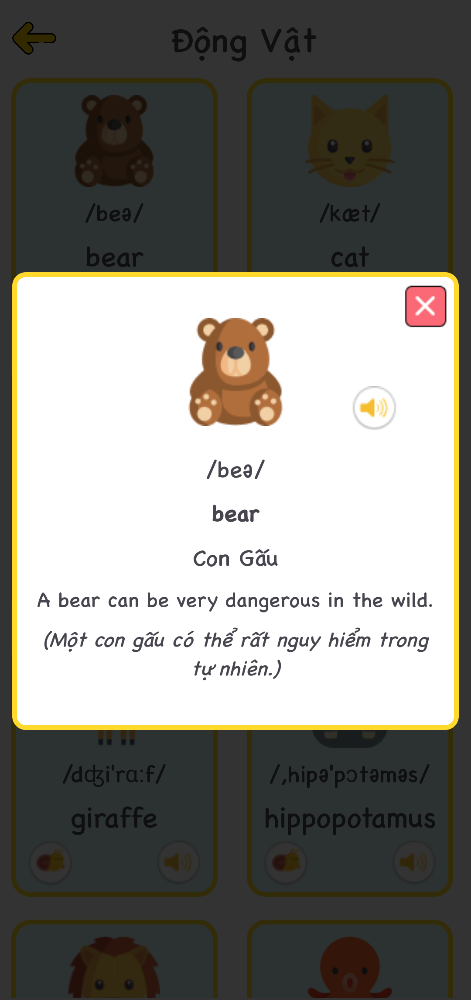
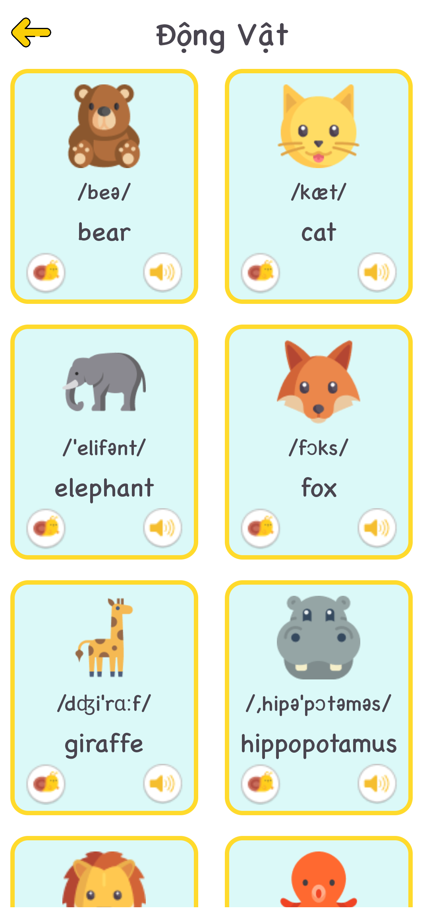

# E-Directory - English Vocabulary Learning App

## 📱 Project Description

E-Directory is an Android application developed to support English vocabulary learning. The app provides an interactive dictionary with diverse learning features, helping users expand their vocabulary effectively.

## 📸 App Screenshots
 |  |  |
 |  |  |

## ✨ Main Features

### 🎯 Learn Vocabulary by Topic

- **Animals** - Vocabulary about different animals  
- **Fruits** - Vocabulary about various fruits  
- **Toys** - Vocabulary about toys  
- **Travel** - Vocabulary about travel and transportation  
- **Family** - Vocabulary about family members  
- **Kitchen** - Vocabulary about kitchen tools and food  
- **Sports** - Vocabulary about sports  
- **Numbers** - Learn English numbers  

### 🔍 Vocabulary Search

- Quick vocabulary search  
- Word suggestions while typing  
- Display detailed vocabulary information (IPA pronunciation, word type)  

### 💾 Personal Vocabulary Management

- **Favorite Words** - Store favorite vocabulary  
- **Recent Words** - Track recently viewed vocabulary  
- Learning history  

### 👤 Account System

- Google login  
- Personal data synchronization  
- Premium features (in development)  

## 🛠️ Technologies Used

- **Programming Language**: Kotlin  
- **Framework**: Android Native  
- **Database**: SQLite (dictionary3.db)  
- **Architecture**: MVC Pattern  
- **UI Components**:
  - RecyclerView  
  - ConstraintLayout  
  - SearchView  
  - PopupWindow  
- **Build System**: Gradle (Kotlin DSL)  

## 📋 System Requirements

- **Android API Level**: 28+ (Android 9.0)  
- **Target SDK**: 35  
- **Minimum SDK**: 28  
- **Java Version**: 1.8  

## 🚀 Installation and Setup

### Prerequisites

- Android Studio Arctic Fox or higher  
- JDK 8 or higher  
- Android SDK  

### Installation Steps

1. **Clone the project**

```bash
git clone [repository-url]
cd btl_app/appEnglish
```

2. **Open project in Android Studio**
- Open Android Studio
- Select "Open an existing Android Studio project"
- Choose the project folder

3. **Sync Gradle**
- Wait for Android Studio to sync dependencies
- Or run `./gradlew build` in terminal

4. **Run the application**
- Connect Android device or create emulator
- Press "Run" button (▶️) in Android Studio
- Or run `./gradlew installDebug`

## 📁 Project Structure

```
app/
├── src/main/
│   ├── java/com/ducsunit/appenglish/
│   │   ├── MainActivity.kt
│   │   ├── StartApp.kt
│   │   ├── LoginActivity.kt
│   │   ├── SearchWordActivity.kt
│   │   ├── RecentWord.kt
│   │   ├── HobbyWord.kt
│   │   └── CourseActivity.kt
│   ├── ui_vocabulary/
│   │   ├── MainVocabulary.kt
│   │   ├── MainAnimals.kt
│   │   ├── MainFruits.kt
│   │   ├── MainToys.kt
│   │   ├── MainTravel.kt
│   │   ├── MainFamily.kt
│   │   ├── MainKitchen.kt
│   │   ├── MainSports.kt
│   │   ├── MainNumbers.kt
│   │   └── VocabularyRepository.kt
│   ├── database/
│   │   └── DatabaseHelper.kt
│   ├── data_class/
│   ├── custom_ui/
│   ├── assets/
│   │   └── dictionary3.db
│   └── res/
└── build.gradle.kts
```

## 🗄️ Database

The app uses SQLite database (`dictionary3.db`) containing:
- Vocabulary table with information: words, IPA pronunciation, word types, meanings
- User management tables
- Tables for managing favorites and history

## 🤝 Contributing

If you want to contribute to the project:

1. Fork the project  
2. Create a new branch for your feature (`git checkout -b feature/AmazingFeature`)  
3. Commit your changes (`git commit -m 'Add some AmazingFeature'`)  
4. Push to the branch (`git push origin feature/AmazingFeature`)  
5. Create a Pull Request  

---

**Note**: This is an educational project, please use responsibly and respect copyright.
